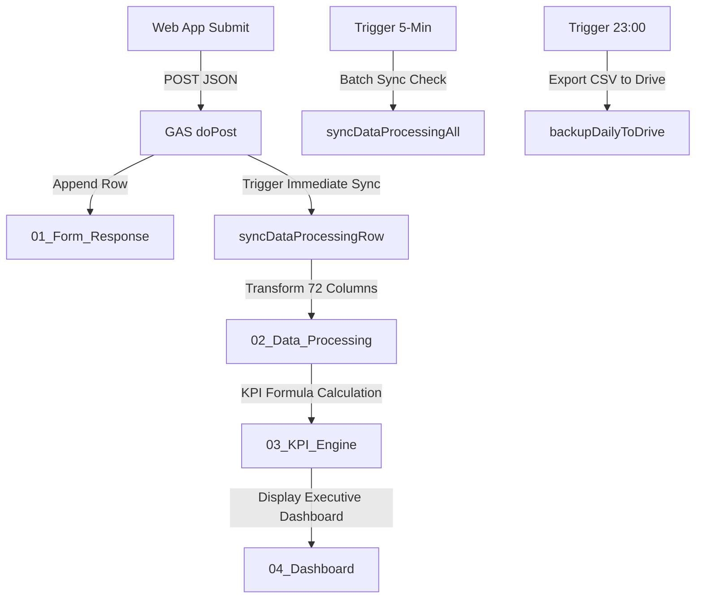

# WORKFLOW: GOOGLE APPS SCRIPT SYNC & BACKUP V3

## 🔄 Quy Trình Tự Động Đồng Bộ & Bảo Trì 6 Tab

## 📋 Các Hàm Thao Tác Chính Trong `google_apps_script.gs` & `kpi_engine.gs`
1. `setupV3Architecture()`: Khởi tạo 6 Tab tiêu chuẩn Tiếng Việt trên Google Sheets.
2. `syncKPIEngine(ss)`: Đồng bộ 10+ Bảng phân tích chỉ số kinh doanh chuyên sâu lên Tab 03 & Tab 04.
3. `backupDailyToDrive()`: Tự động sao lưu dữ liệu ra file CSV trong Google Drive lúc 23:00 hàng ngày.
