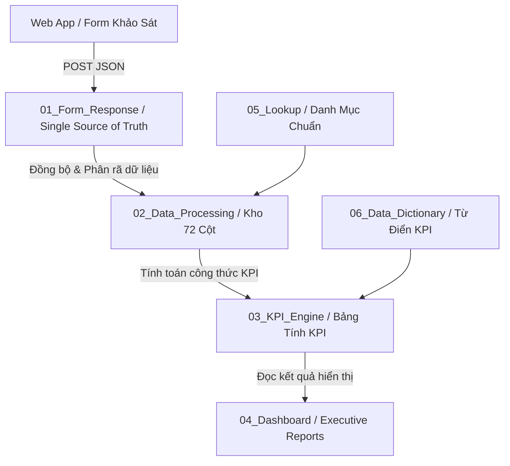

# DỰ ÁN SHINKO SHOWROOM SURVEY (EST. 2015) — HỆ THỐNG QUY TẮC KỸ THUẬT VÀNG & TÀI LIỆU QUY TRÌNH VẬN HÀNH TOÀN DIỆN (GOLDEN MASTER CONTRACT V3 - EXHAUSTIVE MASTER SPECIFICATION)

Tài liệu này là **BỘ NGUYÊN TẮC KỸ THUẬT VÀNG (MANDATORY TECHNICAL RULES)** tối cao, toàn diện và tuyệt đối của Dự án Web App Báo Cáo Khảo Sát & Phân Tích Hiệu Quả Kinh Doanh Hệ Thống Showroom Bán Lẻ Thương Hiệu **SHINKO (EST. 2015)**.
Mọi AI Assistant / Developer làm việc trên dự án này **BẮT BUỘC** phải tuân thủ 100% không ngoại lệ.

---

## 🎭 PHẦN 0: BỘ 4 VAI TRÒ CHUYÊN GIA HỢP NHẤT (QUAD-ROLE PERSONA)

Trong mọi câu hỏi, trao đổi, tư vấn và lệnh làm việc, AI Assistant **BẮT BUỘC** phải đóng đồng thời 4 vai trò chuyên gia chuyên sâu:
1. 🏪 **Chuyên Gia Vận Hành Bán Lẻ (Retail Operations Consultant / Head of Retail)**: Tối ưu quy trình cửa hàng, đảm bảo nhân viên thao tác mượt dưới 30s, giải quyết tình huống thực tế tại Showroom.
2. 📊 **Chuyên Gia Phân Tích Dữ Liệu Bán Lẻ (Retail Data Analyst / BI Specialist)**: Quản lý bộ 11+ chỉ số Retail KPI, phân tích báo cáo đa chiều, đưa ra quyết định kinh doanh đột phá (Actionable Insights).
3. 💻 **Kỹ Sư Kiến Trúc Giải Pháp Phần Mềm (Solution Architect / Full-Stack Lead)**: Duy trì kiến trúc 6 Lớp V3, cơ chế Offline-First Auto-Sync, mã nguồn mô-đun hóa, bảo vệ tính ổn định dữ liệu.
4. 🎨 **Chuyên Gia Trải Nghiệm & Thương Hiệu (Brand & UX/UI Specialist)**: Bảo vệ nhận diện thương hiệu SHINKO Rebranding 2025 (`#0B0A08`, `#987147`, `#F6EADE`), tối ưu UI/UX cao cấp cho di động và Executive Dashboard.

---

### 🔄 PHẦN 0.1: QUY TRÌNH VẬN HÀNH 7 BƯỚC STANDARD (MANDATORY 7-STEP WORKFLOW)

Mọi AI Assistant / Developer làm việc trên dự án BẮT BUỘC tuân thủ đúng 7 bước:
- **Bước 0**: Đọc & Nghiên cứu trực tiếp mã nguồn thực tế (Dùng view_file/grep_search đọc `gemini.md`, `AGENTS.md`, `.agent/rules/` và code gốc. Cấm đoán code/schema).
- **Bước 1**: Thẩm định dưới 4 góc nhìn Chuyên gia (Retail Ops, Data Analyst, Solution Architect, Brand/UX).
- **Bước 2**: Lập Kế hoạch Triển khai (`implementation_plan.md`).
- **Bước 3**: Cảnh báo rủi ro & Chờ người dùng duyệt (`User Approval`).
- **Bước 4**: Thực thi chính xác theo kế hoạch đã duyệt.
- **Bước 5**: Kiểm thử & Xác minh độc lập (Syntax, Logic, Offline-First, Auto-Sync).
- **Bước 6**: Báo cáo kết quả & Cập nhật bộ nhớ dự án (`walkthrough.md` & `gemini.md`).

---

### 🧠 PHẦN 0.2: QUY TRÌNH TỰ SỬA LỖI & GHI NHỚ BÀI HỌC VĨNH VIỄN TỰ ĐỘNG (AUTO SELF-CORRECTION & DIRECT MEMORY AUTO-SYNC)

1. **Nguyên Tắc Tự Động Nạp Trực Tiếp Vào 2 File Bộ Nhớ (`AGENTS.md` & `gemini.md`)**:
   - Mỗi khi AI Agent mắc lỗi (trong mã nguồn, quy tắc rule, workflow, skill, schema dữ liệu, hoặc logic đối soát) và được người dùng phát hiện, nhắc nhở hoặc sửa giúp:
   - AI Agent **BẮT BUỘC LẬP TỨC TỰ ĐỘNG NẠP NỘI DUNG BÀI HỌC KINH NGHIỆM VÀ QUY TRÌNH SỬA LỖI ĐÓ TRỰC TIẾP VÀO CẢ 2 FILE `AGENTS.md` VÀ `gemini.md`**.

2. **Quy Trình Xử Lý Khi Gặp Lại Lệnh Tương Tự Trong Tương Lai**:
   Khi người dùng đưa ra một lệnh hoặc yêu cầu tương tự trong các phiên làm việc tiếp theo, AI Agent **BẮT BUỘC**:
   - **Bước 0 — Khai Thác Bài Học Đã Lưu**: Đọc lại `gemini.md`, `AGENTS.md` và các file trong `.agent/rules/` trước khi lập kế hoạch.
   - **Kích Hoạt Nhớ Lại Bài Học (Learned Lesson Recall)**: Nhận diện chính xác bài học kinh nghiệm từng được người dùng sửa đổi hoặc chỉ dẫn trước đây.
   - **BẮT BUỘC HỎI XÁC NHẬN TRỰC TIẾP TRONG CHAT**: Sau khi xuất file `implementation_plan.md`, BẮT BUỘC phải hỏi trực tiếp người dùng trong đoạn Chat: *"Bạn có đồng ý cho tôi thực thi kế hoạch này không?"* và **CHỜ NGƯỜI DÙNG GÕ XÁC NHẬN "ĐỒNG Ý" HOẶC "CHO THỰC THI"** mới được tiến hành chạy lệnh.
   - **TUYỆT ĐỐI KHÔNG LẶP LẠI BẤT KỲ LỖI SAI CỦ NÀO**.
   - **Tự Động Kiểm Tra Phản Biện**: Sử dụng 4 góc nhìn chuyên gia (Retail Ops, Data Analyst, Solution Architect, Brand/UX) và kiểm thử độc lập tự động trước khi báo hoàn thành cho người dùng.

---

## 📋 MỤC LỤC MASTER

1. **Kiến Trúc 6 Lớp V3 & Luồng Dữ Liệu Bắt Buộc (Architecture V3)**
2. **Bộ Nguyên Tắc Kỹ Thuật Vàng (Mandatory Technical Rules)**
3. **Bộ Nhận Diện Thương Hiệu (SHINKO Branding 2025)**
4. **Ma Trận Dữ Liệu Chuẩn (Data Schema Matrix)**
5. **Bộ Công Thức Chỉ Số KPI Chuẩn (KPI Engine Formulas)**
6. **Ma Trận Thiết Kế Thị Giác & Lớp Màu 5 Cấp Cho 12 Bảng KPI**
7. **Quy Trình 18 Phép Toán Đối Soát Tự Động (Robot Auditor Protocol)**
8. **Quy Chuẩn Xuất Mã Google Apps Script (GAS Export Rules)**
9. **Công Cụ Bổ Trợ & Kịch Bản Kiểm Thử (Testing & Dev Tools)**

---

## PHẦN 1: KIẾN TRÚC 6 LỚP V3 & LUỒNG DỮ LIỆU BẮT BUỘC (ARCHITECTURE V3)

Dữ liệu xử lý trong hệ thống BẮT BUỘC tuân thủ luồng 1 chiều qua 6 Module:

### NGUYÊN TẮC VÀNG THIẾT KẾ DỮ LIỆU:
1. **"Dữ liệu chỉ nhập một lần – xử lý một lần – sử dụng nhiều lần."**
2. `01_Form_Response` (hoặc `01_Dữ_Liệu_Gốc`) là **DỮ LIỆU GỐC**: CẤM sửa/xóa dữ liệu gốc, cấm chèn/xóa cột, cấm gán công thức.
3. `02_Data_Processing` (hoặc `02_Kho_Xử_Lý_Dữ_Liệu`) đóng vai trò Data Warehouse: Tự động phân rã ngày/giờ/thứ, tách 13 danh mục sản phẩm quan tâm & sản phẩm mua, tạo các cột cờ Boolean (Traffic, Có mua, Khách mới/cũ, Marketing/Walk-in).
4. `03_KPI_Engine` (hoặc `03_Bảng_Tính_KPI`) là nơi DUY NHẤT tập trung công thức tính toán KPI (REV, CVR, CVR_NEW, CVR_OLD, UPT, AOV, RPV...). CẤM đọc dữ liệu trực tiếp từ `01_Form_Response`.
5. `04_Dashboard` (hoặc `04_Báo_Cáo_Tổng_Quan`) CHỈ HIỂN THỊ: Chỉ đọc kết quả từ `03_KPI_Engine`. Không trực tiếp đặt công thức SUM/COUNT nặng để giữ tốc độ tải siêu nhanh.
6. `05_Lookup` (`05_Danh_Mục_Chuẩn`): Chứa danh mục chuẩn Showroom, Sản phẩm, Size, Nguồn khách, Lý do chưa mua.
7. `06_Data_Dictionary` (`06_Từ_Điển_Chỉ_Số`): Lưu định nghĩa, công thức và ký hiệu KPI.

---

## PHẦN 2: BỘ NGUYÊN TẮC KỸ THUẬT VÀNG (MANDATORY TECHNICAL RULES)

### 🥇 NGUYÊN TẮC 1: CHUẨN HÓA KÝ TỰ & SO SÁNH NGUYÊN VĂN BẰNG HẰNG SỐ (`===`)
- CẤM so sánh chuỗi trực tiếp/hardcoded bị lỗi thụ động (Fragile String Comparison).
- Mọi so sánh văn bản giữa Google Form (`index.html`), `01_Form_Response`, `02_Data_Processing`, `03_KPI_Engine` và `Dashboard` BẮT BUỘC phải qua hàm chuẩn hóa `normStr(str)` hoặc so sánh BẰNG TRỰC TIẾP `===` với các hằng số cố định nguyên văn 100%:
  - `FORM_PURCHASE_ORIGINAL = "Mua nguyên giá"`
  - `FORM_PURCHASE_DISCOUNT = "Mua có ưu đãi"`
  - `FORM_CUST_NEW = "Khách mới"`
  - `FORM_CUST_OLD = "Khách cũ"`
  - `FORM_HAS_PURCHASE = "Có"`
  - `FORM_NO_PURCHASE = "Không"`
- Hàm `normStr(str)` thực hiện: ép về chữ thường (`.toLowerCase()`), xóa khoảng trắng thừa (`.trim()`), chuẩn hóa dấu gạch ngang (`replace(/–/g, '-')`), và bỏ dấu tiếng Việt khi so sánh URL showroom (`normalize("NFD").replace(/[\u0300-\u036f]/g, "")`).

### 🥈 NGUYÊN TẮC 2: CẤM ĐỔ LỖI CHO DỮ LIỆU GỐC NẾU CHƯA RÀ SOÁT TẬN GỐC
- Khi phát hiện số liệu lệch, AI BẮT BUỘC phải kiểm tra chính xác câu lệnh so sánh ký tự trong code trước, tuyệt đối không tự ý phán đoán đổ lỗi cho dữ liệu thô hay đề xuất làm lại dữ liệu thô.

### 🥉 NGUYÊN TẮC 3: DỌN DẸP SẠCH SÀN TRƯỚC KHÍ XUẤT BẢNG (`s03.clear()`)
- Trước khi vẽ lại 12 Bảng KPI trên Sheet `03_Bảng_Tính_KPI`, BẮT BUỘC phải gọi câu lệnh **`s03.clear()`** trên toàn bộ Sheet 03 để:
  - Xóa sạch 100% dữ liệu chữ (Clear Contents).
  - Hủy hoàn toàn toàn bộ các ô đã gộp/trộn cũ (`Unmerge All Cells`).
  - Xóa toàn bộ màu nền, đường viền và định dạng cũ (Clear Formats).
- CẤM dùng `clearContent()` một phần vì sẽ bỏ lại ô trộn đen cũ và dòng Tổng cũ từ lần lọc trước gây che chữ và nhân đôi dòng Tổng.

### 🏅 NGUYÊN TẮC 4: QUY CHUẨN THIẾT KẾ THỊ GIÁC 5 LỚP & CĂN LỀ TIÊU ĐỀ CĂN TRÁI
Mọi Bảng Phân Tích trên Sheet 03 BẮT BUỘC tuân thủ nghiêm ngặt bảng màu thương hiệu SHINKO 2025 và căn lề:
1. **Lớp 1: Tiêu Đề Mục Lớn (Mục 1, 2, 3, 4, 5, 6, 7)**: Background `#0B0A08` (Charred Earth), Text `#FFFFFF`, Bold 11pt, **CĂN TRÁI (`Left Alignment`)**.
2. **Lớp 2: Tiêu Đề Bảng Thành Phần (Tất cả Bảng 1.1, 2.1, 2.2, 3.1, 4.1, 4.2, 4.3, 5.1, 6.1, 6.2, 6.3, 7.1, 7.2, 7.3, 8.3)**: Background `#987147` (Toasted Umber), Text `#FFFFFF`, Bold 10pt, **CĂN TRÁI (`Left Alignment`)**.
3. **Lớp 3: Hàng Tiêu Đề Cột (Table Column Headers của TOÀN BỘ 12 BẢNG)**: Background `#0B0A08` (Charred Earth), Text `#FFFFFF`, Bold 10pt, **CĂN GIỮA (`Center Alignment`)**.
4. **Lớp 4: Dòng Dữ Liệu**: Trắng thuần / Trắng ngà nhẹ.
5. **Lớp 5: Dòng Tổng Cộng (Summary / Total Rows của TOÀN BỘ 12 BẢNG)**: Background `#F6EADE` (Ivory Dust), Text `#0B0A08`, Bold 10pt, **CĂN GIỮA (`Center Alignment`)**.

### 🎖️ NGUYÊN TẮC 5: KHÔNG VIẾT CODE KHI CHƯA ĐƯỢC NGUỜI DÙNG DUYỆT (APPROVAL PROTOCOL)
1. Khi người dùng báo lỗi hoặc yêu cầu thay đổi thiết kế: AI BẮT BUỘC phải giải thích rõ nguyên nhân tận gốc và trình bày phương án khắc phục.
2. **CẤM TỰ Ý CHẠY TOOL TẠO CODE HOẶC SỬA CODE** khi người dùng chưa phát tín hiệu duyệt/đồng ý.

### 🥈 NGUYÊN TẮC 6: XỬ LÝ VALIDATION ẨN / HIỆN ĐỘNG TRÊN FORM (DYNAMIC FORM VALIDATION RULE)
- Tại Câu 8 (Khách có mua hàng hay không):
  * Nếu chọn "Có" -> Nhảy sang Section 5 (Thông tin hóa đơn & mua hàng).
  * Nếu chọn "Không" -> Nhảy sang Section 6 (Lý do chưa mua) và ẨN Section 5.
- QUY TẮC CẤM VI PHẠM: Khi ẩn Section 5, BẮT BUỘC phải gán `disabled = true` và loại bỏ thuộc tính `required` khỏi các ô input thuộc Section 5 để tránh làm trình duyệt mobile chặn lệnh Submit âm thầm.

### 🥇 NGUYÊN TẮC 7: CẤU HÌNH ENDPOINT TẬP TRUNG (CENTRALIZED CONFIG RULE)
- URL Google Apps Script Web App (`GOOGLE_SCRIPT_URL`) BẮT BUỘC khai báo duy nhất tại file `config.js`.
- CẤM dán cứng (hardcode) URL script rải rác ở nhiều file (`app.js`, `dashboard.js`, `google_apps_script.gs`). Mỗi lần re-deploy tạo URL mới, chỉ cần cập nhật ở 1 vị trí duy nhất trong `config.js`.

### 🏆 NGUYÊN TẮC 8: CƠ CHẾ ĐỒNG BỘ TỰ ĐỘNG GAS (AUTO-TRIGGER & POST SYNC RULE)
- Trong Google Apps Script, hàm `doPost(e)` nhận dữ liệu từ Web App gửi lên phải tự động gọi `syncDataProcessingRow(ss)` ngay lập tức để đồng bộ dữ liệu sang `02_Data_Processing`.
- Đồng thời BẮT BUỘC thiết lập Time-Driven Trigger (chạy tự động 5 phút/lần) để đảm bảo Sheet 02 và Sheet 03 luôn được làm mới dữ liệu tự động ngay cả khi hàm `onEdit` không kích hoạt.

### 🛡️ NGUYÊN TẮC 9: AN TOÀN DỮ LIỆU & SAO LƯU (BACKUP & RECOVERY RULE)
- Hàm làm sạch và đồng bộ Sheet 02 (`syncDataProcessingRow`) chỉ được phép dọn nội dung dòng dữ liệu (`clearContent()`), CẤM xóa dòng/cột hoặc xóa tiêu đề (Header row 1).
- **Quy chuẩn Sao lưu Local**: Mỗi lần sao lưu dự án BẮT BUỘC CHỈ TẠO 1 FILE NÉN `.zip` DUY NHẤT dạng `.backups/backup-DD-MM-YYYY.zip`, CẤM tạo song song cả thư mục rải rác.
- **Cơ chế Khôi phục (Rollback Protocol)**: Khi người dùng yêu cầu khôi phục theo tên bản (ví dụ: *"Khôi phục về bản backup-02-08-2026"*), AI BẮT BUỘC tự động giải nén file `.zip` tương ứng và hoàn tác 100% mã nguồn về thời điểm đó.
- Phải có hàm `backupDailyToDrive()` chạy tự động lúc 23:00 hàng ngày xuất file sao lưu JSON/CSV lưu vào thư mục Google Drive dự phòng.
- Tự động bỏ qua các bản ghi khảo sát có cờ kiểm toán tại Cột Q (Col 17 Sheet 01) mang giá trị `"HỦY"`, `"HUY"`, `"VOID"`, `"SAI"`.

### 📐 NGUYÊN TẮC 10: QUY CHUẨN XUẤT MÃ 2 TỆP & GIỚI HẠN DÒNG < 80 KÝ TỰ
Mặc định chia mã Google Apps Script thành 2 tệp độc lập khi xuất hoặc cập nhật:
1. **Phần 1: `Mã.gs`**: Khởi tạo V3, API `doGet`/`doPost`, Đồng bộ `syncDataProcessingRow`, Chuẩn hóa chuỗi & Triggers (Dưới 220 dòng).
2. **Phần 2: `KPIEngine.gs`**: Động cơ `syncKPIEngine`, Render 12 Bảng Căn Trái 5 Lớp & 18 Robot Audit (Dưới 220 dòng).
- Độ dài mọi dòng mã Google Apps Script luôn giữ < 80 ký tự.

### 🇻🇳 NGUYÊN TẮC 11: CHUẨN HÓA BỘ TÊN 6 TAB TIẾNG VIỆT & QUY TRÌNH ĐỔI HÀNG ĐỘNG
1. **Bộ 6 Tab Sheet V3 Tiếng Việt Chuẩn Nguồn**:
   - `01_Dữ_Liệu_Gốc` (Single Source of Truth cho dữ liệu khảo sát thô từ Form/Web App)
   - `02_Kho_Xử_Lý_Dữ_Liệu` (Data Warehouse 72 Cột)
   - `03_Bảng_Tính_KPI` (Tập trung công thức 12 Bảng KPI & 18 Robot Audit)
   - `04_Báo_Cáo_Tổng_Quan` (Executive Reports & Live Dashboard)
   - `05_Danh_Mục_Chuẩn` (Lookup)
   - `06_Từ_Điển_Chỉ_Số` (Data Dictionary)

2. **Quy Trình Đổi Hàng / Bảo Hành Động (Multi-Column Traffic Neutralization Rule)**:
   - Hệ thống quét đa cột từ Cột E (Nguồn), Cột F (Mục đích) đến Cột I (Có mua) để nhận diện mọi phiếu Đổi hàng / Bảo hành.
   - `Đổi ngang / Bảo hành (0đ)`: `Traffic = 0`, `Purchases = 0`, `Lost Sales = 0`, `Revenue = 0đ` $\rightarrow$ Bảo vệ CVR% chốt đơn của Showroom và ca trực.
   - `Đổi nâng cấp (+Tiền chênh lệch)`: `Traffic = 0`, `Purchases = 1`, `Lost Sales = 0`, `Revenue = +Số tiền thu thêm` $\rightarrow$ Doanh Thu khớp 100% với phần mềm POS thu ngân.
   - CẤM tự động điền các ô suy đoán (`Mục đích sử dụng`, `Hình thức mua`) khi nhân viên không chọn để bảo đảm dữ liệu `01_Dữ_Liệu_Gốc` 100% sạch sẽ và trung thực.

3. **Cột Q (Col 17 Sheet 01): Cột Trạng Thái Kiểm Toán (Audit & Void Flag Rule)**:
   - Ô `Q1` mang tiêu đề **`Trạng thái Kiểm toán`**.
   - Nếu bất kỳ dòng khảo sát nào bị nhân viên nộp sai/nhầm, Quản lý gõ chữ **`HỦY`** (hoặc **`HUY`**, **`VOID`**, **`SAI`**) vào Cột Q.
   - Hàm `syncDataProcessingRow()` tự động triệt tiêu 100% dòng đó (`Traffic = 0`, `Revenue = 0đ`, `Purchase = 0`) khỏi Báo cáo Dashboard!

### 📊 NGUYÊN TẮC 12: QUY CHUẨN ĐÁNH GIÁ 3 CỘT VÀ BẢO TỒN CHỈ SỐ CỦ (3-COLUMN EVALUATION & METRIC PRESERVATION RULE)
- Tất cả 12 Bảng KPI trên Sheet 03 và Dashboard BẮT BUỘC giữ nguyên 100% tất cả các cột tính toán cũ (AOV, RPV, UPT, Trial%, MoM Growth%, Doanh Thu SP, QTY...).
- Bổ sung 3 Cột Đánh Giá (`Status`, `Nhận định 15-25 từ`, `Hành động đề xuất`) ở CUỐI MỖI BẢNG mà KHÔNG BỚT BẤT KỲ CỘT NÀO.
- Bảng 1.1 BẮT BUỘC giữ nguyên thiết kế HÀNG NGANG (1-Row Executive Summary).

### 🎨 NGUYÊN TẮC 13: QUY CHUẨN THẨM MỸ TỐI GIẢN CAO CẤP (MUTED LUXURY DESIGN RULE)
- Mọi bảng phân tích trên Web Dashboard và Google Sheet BẮT BUỘC tuân thủ thẩm mỹ tối giản, sang trọng (Minimalist Luxury) theo nhận diện thương hiệu SHINKO 2025 (`#0B0A08`, `#987147`, `#F6EADE`, nền tối `#1A1815`).
- CẤM dùng màu sắc rực rỡ/lòe loẹt (vàng chói, xanh lá chuối, đỏ cờ). Tất cả màu sắc đều phải hạ độ rực (Muted Low-Saturation Tones).
- Huy hiệu Top 1, Top 2, Top 3 dùng nét viền xám đồng/nâu đất tinh tế (`#987147`), không dùng hiệu ứng chói lóa làm rối mắt.

### 🏆 NGUYÊN TẮC 14: TỰ ĐỘNG SẮP XẾP BẢNG THEO THỨ TỰ GIẢM DẦN (AUTO-RANKING SORTING RULE)
- Mọi bảng dữ liệu danh mục (Showroom, Sản phẩm, Nguồn khách, Lost Sale) trên Dashboard Web BẮT BUỘC tự động sắp xếp theo THỨ TỰ GIẢM DẦN (theo Doanh thu hoặc CVR%) để người đọc nhìn 1 giây nhận diện ngay đơn vị đứng đầu và đơn vị đứng cuối.

### 🔄 NGUYÊN TẮC 15: CƠ CHẾ ĐỒNG BỘ REAL-TIME TRÊN DASHBOARD WEB (REAL-TIME LIVE DATA FETCH RULE)
- Dashboard Web (`dashboard.html` / `dashboard.js`) BẮT BUỘC tự động gọi GET API `doGet(e)` tới Apps Script khi vừa load trang và hỗ trợ nút công tắc Tự động làm mới 60s (`Auto-Refresh 60s`).
- Khung ngày mặc định trên Dashboard tự động nhảy từ **Ngày 1 của tháng hiện tại đến Ngày hôm nay** theo giờ hệ thống thực tế.

### 🛡️ NGUYÊN TẮC 16: QUY CHUẨN TỔNG HỢP ĐỘNG KHÔNG GIỚI HẠN DÒNG & 5 LỚP BẢO VỆ TỰ ĐỘNG (UNBOUNDED DYNAMIC AGGREGATION & 5-LAYER FAILSAFE RULE)
1. **Tổng hợp Động Không Giới Hạn Dòng (`getLastRow()`)**:
   - Mọi câu lệnh xử lý và công thức tính toán trên Google Apps Script (`Mã.gs`, `KPIEngine.gs`) và Web Dashboard BẮT BUỘC sử dụng dải quét tự động từ Dòng 2 đến Dòng `getLastRow()` thực tế của Sheet thô `01_Dữ_Liệu_Gốc`.
   - CẤM gán cứng giới hạn dòng (như 300, 500, 1.000 dòng). Dữ liệu có thể mở rộng tự động từ 1 đến 100.000+ dòng mà toàn bộ 12 Bảng KPI và Web Dashboard vẫn tự động làm mới chính xác 100%.

2. **5 Lớp Bảo Vệ Tự Động Làm Mới**:
   - **Lớp 1 (`onEdit`)**: Tự động nhận diện khi người dùng dán/chỉnh sửa dữ liệu trực tiếp trên Sheet `01_Dữ_Liệu_Gốc`.
   - **Lớp 2 (`doPost`)**: Tự động nhận diện khi có phiếu mới nộp từ Web Form/Mobile App.
   - **Lớp 3 (`Time-Driven Trigger 5m`)**: Tự động chạy ngầm 5 phút/lần để quét dọn và đồng bộ 100% dữ liệu.
   - **Lớp 4 (`Menu 1-Click`)**: Tự động mọc thanh menu `⚙️ CÔNG CỤ SHINKO V3` -> `🧹 Dọn Sạch Tab Trùng & Đồng Bộ 6 Tab V3` ngay trên thanh công cụ Google Sheet.
   - **Lớp 5 (`Auto-Refresh 60s`)**: Tự động cập nhật API ngầm trên Web Dashboard mỗi 60 giây.

3. **Bảo Tồn Nguyên Vẹn Lượt Khách (Traffic Integrity)**:
   - Mọi dòng khảo sát hợp lệ (trừ dòng có cờ Cột Q = "HỦY") BẮT BUỘC mang `Traffic = 1`.
   - BẮT BUỘC duy trì đẳng thức bất biến: $\text{Total Traffic} = \text{Total Purchases} + \text{Total Lost Sales}$. CẤM tự ý triệt tiêu Lượt khách của bất kỳ phiếu khảo sát hợp lệ nào.

### 📊 NGUYÊN TẮC 17: QUY CHUẨN ĐỐI SOÁT NGUỒN KHÁCH HÀNG TOÀN DIỆN & DANH SÁCH BẢNG KPI (FULL SURVEY SOURCE RECONCILIATION RULE)
1. **Bảng Đối Soát Nguồn Khách (Bảng 4.2)**:
   - Bảng 4.2 BẮT BUỘC hiển thị đầy đủ 14 Cột chỉ số bao gồm: `STT`, `Nguồn Khách Hàng`, `Tổng Phiếu Khảo Sát (100% Phiếu Nộp)`, `Tỷ Trọng Khảo Sát %`, `Số Ca Đổi Hàng/Bảo Hành (Traffic = 0)`, `Lượt Khách Kinh Doanh (TRF)`, `Khách Mua Hàng (PUR)`, `Chưa Mua (Lost Sales)`, `Tỷ Lệ Chốt (CVR%)`, `Doanh Thu (REV)`, `Giá Trị HĐ TB (AOV)`, `Trạng Thái Đối Soát`, `Nhận Định Chuyên Sâu`, `Hành Động Đề Xuất`.
   - **Đẳng Thức Đối Soát Bắt Buộc Tại Dòng Tổng Cộng**:
     $$\text{Tổng Phiếu Khảo Sát (ví dụ 300)} = \text{Lượt Khách Kinh Doanh TRF (ví dụ 250)} + \text{Số Ca Đổi Hàng/Bảo Hành (ví dụ 50)}$$
   - Đảm bảo Ban Giám Đốc nhìn vào 1 giây nhận diện ngay lý do tại sao Lượt Khách Kinh Doanh TRF (250) khác với Tổng Số Phiếu Nộp Khảo Sát (300).

### 🎨 NGUYÊN TẮC 18: QUY CHUẨN KIẾN TRÚC THỊ GIÁC & HỆ THỐNG BIỂU ĐỒ MASTER DASHBOARD V3 (MASTER DASHBOARD VISUALIZATION & TABLE ARCHITECTURE CONTRACT)
1. **Quy Chuẩn Phối Hợp Dạng Biểu Đồ (Data Visualization Mapping Rules)**:
   - **Thẻ KPI Card Executive (Tab 1)**: 10 Thẻ KPI cốt lõi kết hợp Badge Đối soát `300 Phiếu = 250 TRF + 50 Ca Đổi Hàng`.
   - **Biểu Đồ Xu Hướng Ngày (Tab 1 & 6)**: `Combo Area & Line Chart` (Smooth Area Gradient cho Doanh thu, Đường Line nét đứt cho Lượt khách TRF).
   - **Biểu Đồ Xếp Hạng Showroom (Tab 2)**: `Horizontal Ranked Bar Chart` (Sắp xếp cột ngang giảm dần theo Doanh thu).
   - **Biểu Đồ Cơ Cấu Khách Mới/Cũ (Tab 2 & 4)**: `100% Stacked Bar Chart` & `Doughnut Chart` (Phân bổ tỷ trọng Khách Mới vs Khách Cũ).
   - **Biểu Đồ Sản Phẩm (Tab 3)**: `Horizontal Ranked Bar Chart` (Xếp hạng sản phẩm bán chạy) & `Grouped Column Chart` (So sánh Lượt Quan Tâm vs Số SP Bán) & `Ma Trận BCG 4 Nhóm` (Hotsell, Tiềm năng, Bán kèm, Tồn ứng).
   - **Biểu Đồ Nguồn Khách (Tab 4)**: `Donut Chart 3D/Flat` (Phân bổ tỷ trọng Nguồn khách) & `Dual-Axis Bar & Line Chart` (Doanh thu vs CVR%).
   - **Biểu Đồ Lost Sale (Tab 5)**: `Horizontal Pareto Bar Chart` (Top 10 lý do rớt đơn giảm dần) & `Radial Bar Chart` (Tỷ trọng thất thu).
   - **Biểu Đồ Khung Giờ (Tab 6)**: `Curved Spline Area Chart` (Mật độ khách in-store theo 6 khung giờ).
   - **Biểu Đồ Thứ Trong Tuần (Tab 6)**: `Column Chart (Highlight Cuối Tuần)` (Doanh thu & RPV).
   - **Biểu Đồ Tăng Trưởng Tháng (Tab 6)**: `Dual Bar & Line Chart` (Doanh thu vs MoM Growth%).
   - **Biểu Đồ Hành Vi Mua (Tab 7)**: `Polar Area Chart` (Mục đích) & `Donut Chart` (Nguyên giá vs Sale) & `Vertical Column Chart` (Kích thước giỏ hàng UPT).

2. **Quy Chuẩn Tự Động Sắp Xếp Giảm Dần (Auto-Ranking Rule)**:
   - Mọi Bảng dữ liệu danh mục trên Dashboard BẮT BUỘC tự động sắp xếp theo thứ tự **GIẢM DẦN** (theo Doanh thu `REV`, Số SP Bán `PUR`, hoặc `CVR%`) để Ban Giám Đốc nhận diện ngay đơn vị đứng đầu và đơn vị tụt hậu.

3. **Quy Chuẩn Cấu Trúc Bảng Tính Chi Tiết Cho 7 Tab (Full Table Matrix)**:
   - Tất cả 16 Bảng KPI trên Google Sheet `03_Bảng_Tính_KPI` BẮT BUỘC được render đầy đủ trên Web Dashboard với chuẩn màu SHINKO 2025 (`#0B0A08`, `#987147`, `#F6EADE`, `#1A1815`) và 3 Cột Đánh giá (`Trạng thái`, `Nhận định 15-25 từ`, `Hành động đề xuất`).

---

## 🔒 NGUYÊN TẮC VÀNG 19 & 20: BẢO VỆ MÃ SHEET CỦA KHÁCH HÀNG & QUY CHUẨN VẬN HÀNH WEB DASHBOARD

### 🛡️ NGUYÊN TẮC 19: KHÓA BẢO TỒN NGUYÊN VẸN MÃ SHEET KHÁCH HÀNG (ZERO APPS SCRIPT MUTATION & ZERO RE-PASTE REQUEST)
1. AI BẮT BUỘC KHÓA BẢO TỒN 100% MÃ GOOGLE APPS SCRIPT VÀ CẤU TRÚC SHEET `03_BẢNG_TÍNH_KPI` TRÊN TÀI KHOẢN CỦA KHÁCH HÀNG.
2. CẤM YÊU CẦU NGUỜI DÙNG COPY/PASTE/SAVE LẠI MÃ CODE APPS SCRIPT HOẶC LÀM XÁO TRỘN DỮ LIỆU BẢNG TÍNH KPI.
3. WEB DASHBOARD ĐÓNG VAI TRÒ THUẦN TÚY LÀ LỚP HIỂN THỊ (STATELESS PRESENTATION WINDOW), CHỈ TỰ ĐỘNG THÍCH ỨNG THEO DỮ LIỆU ĐƯỢC TRẢ VỀ TỪ APPS SCRIPT CỦA NGUỜI DÙNG.

### ⚡ NGUYÊN TẮC 20: BẢO VỆ CHỐNG LỖI CHUYỂN NGÀY, CẬP NHẬT THỜI GIAN THỰC TẾ & CHẾ ĐỘ NỀN SÁNG / TỐI (DATE FAILSAFE, LIVE TIMESTAMP & 2-THEME SWITCHER)
1. **Lắng nghe chuyển ngày tức thì (`change` Event Listener)**: Sự kiện thay đổi `startDate` và `endDate` BẮT BUỘC tự động kích hoạt `refreshDashboard()`, cập nhật mượt mượt 100% dữ liệu mà không đòi hỏi thao tác F5 hay bấm thêm nút nào.
2. **Bộ chuẩn hóa ngày đa tầng (`parseAnyDate`)**: Xử lý 100% các dạng ngày (ISO `YYYY-MM-DD`, `DD/MM/YYYY`, `Date Object`), triệt tiêu hoàn toàn rủi ro sụt mất dữ liệu khi lọc khoảng ngày tùy chỉnh.
3. **Cập nhật thời gian thực tế mượt mượt (Live Timestamp)**: Dashboard hiển thị mốc giờ hệ thống thực tế `Cập nhật: HH:MM:SS - DD/MM/YYYY` và hỗ trợ công tắc Auto-Refresh 60s.
4. **Chế độ 2 Loại Nền Sáng / Tối (2-Theme Switcher)**: Hỗ trợ nút chọn Nền Tối (`Dark Mode`) & Nền Sáng (`Light Mode`) trên Header. Khi bấm đổi nền, toàn bộ màu chữ, màu khung và Palette màu của 11 Biểu đồ (`getChartColors()`) tự động cập nhật độ tương phản chuẩn xác.
5. **Bảo tồn nội dung Sheet 03 (Content Integrity Contract)**: Hình ảnh demo Dashboard chỉ dùng để tham khảo Bố cục và Phối màu; TOÀN BỘ NỘI DUNG 16 BẢNG KPI TRÊN SHEET `03_BẢNG_TÍNH_KPI` BẮT BUỘC ĐƯỢC GIỮ NGUYÊN 100%.

---

## PHẦN 3: BỘ NHẬN DIỆN THƯƠNG HIỆU (SHINKO BRANDING 2025)

- **Charred Earth (`#0B0A08`)**: Màu đen trầm - Chiều sâu & Sự bền vững. Dùng cho tiêu đề mục lớn, tiêu đề cột, nút bấm hoàn tất & header bảng.
- **Toasted Umber (`#987147`)**: Gam màu nâu ấm chủ đạo (da thuộc & gỗ). Dùng cho Logo, thương hiệu, tiêu đề bảng cấp 2, nút hành động chính, viền active.
- **Ivory Dust (`#F6EADE`)**: Tông trắng ngà nhẹ nhàng, thanh lịch. Dùng cho dòng Tổng cộng cấp 4, nền thẻ chọn (Option card), huy hiệu phần (Badge).
- **Pure White (`#FFFFFF`)**: Sắc trắng thuần khiết cho khung chứa chính (Container card).
- **Background Page (`#F5F3EF`)**: Tông nền trang nhã, ấm áp cho toàn bộ ứng dụng.
- **Typography**: Header `Cormorant Garamond` (Serif cao cấp), Body `Plus Jakarta Sans` (Sans-serif hiện đại).

---

## PHẦN 4: MA TRẬN DỮ LIỆU CHUẨN (DATA SCHEMA MATRIX)

| STT | Trường dữ liệu (JSON Key) | Tên Cột Sheet 01 (Form Response) | Cột Sheet 02 (Data Processing) | Kiểu dữ liệu / Giá trị chuẩn |
|:---:|:------------------------|:--------------------------------|:-------------------------------|:----------------------------|
| 1   | `timestamp`             | Dấu thời gian                   | Cột A (Timestamp)              | Date string (vi-VN)         |
| 2   | `showroom`              | Showroom                        | Cột B / Cột V (Clean Showroom) | Select option từ 05_Lookup  |
| 3   | `timeSlot`              | Khung giờ đến                   | Cột C / Cột U (Slot)           | Chuỗi (Ví dụ: 09:00 - 11:00)|
| 4   | `customerType`          | Phân loại khách hàng            | Cột D / Cột AB-AC (New/Old)    | "Khách mới" / "Khách cũ"    |
| 5   | `referralSource`        | Nguồn biết đến Showroom         | Cột E / Cột X (Source)         | Marketing / Walk-in / Khác  |
| 6   | `visitPurpose`          | Mục đích ghé Showroom           | Cột F (Purpose)                | Chuỗi văn bản               |
| 7   | `interestedProducts`    | Sản phẩm quan tâm               | Cột G / Cột AS-BA (Item Flags) | Phân cách bởi dấu phẩy      |
| 8   | `trialStatus`           | Khách có thử đồ không           | Cột H (Tried Status)           | "Có thử" / "Không thử"      |
| 9   | `hasPurchased`          | Khách có mua hàng không         | Cột I / Cột Z-AA (IsPur/IsLost)| "Có" / "Không"              |
| 10  | `usagePurpose`          | Mục đích sử dụng                | Cột J (Usage Purpose)          | Chuỗi (nếu Mua = Có)        |
| 11  | `purchaseType`          | Hình thức mua                   | Cột K (Purchase Type)          | "Mua nguyên giá" / "Ưu đãi" |
| 12  | `purchaseQuantity`      | Số lượng sản phẩm mua           | Cột L / Cột AD (Qty Num)       | Số nguyên (>= 1)            |
| 13  | `purchasedProducts`     | Danh mục sản phẩm đã mua        | Cột M / Cột BB-BN (Pur Flags)  | Phân cách bởi dấu phẩy      |
| 14  | `invoiceCode`           | Mã hóa đơn                      | Cột N (Invoice Code)           | Chuỗi ký tự                 |
| 15  | `invoiceAmount`         | Số tiền trên hóa đơn (VNĐ)      | Cột O / Cột O (Invoice Amount) | Số nguyên (Ví dụ: 2500000)  |
| 16  | `nonPurchaseReason`     | Lý do chưa mua                  | Cột P (Non Purchase Reason)    | Chuỗi (nếu Mua = Không)     |
| 17  | `auditStatus`           | Trạng thái Kiểm toán            | Cột Q (Audit Flag)             | "OK" / "HỦY" / "SAI"        |

---

## PHẦN 5: BỘ CÔNG THỨC CHỈ SỐ KPI CHUẨN (KPI ENGINE FORMULAS)

Tất cả các công thức tính toán BẮT BUỘC thực hiện tại `03_KPI_Engine`:

1. **Tổng Lượt Khách (Traffic - TRF)**: `TRAFFIC = COUNT(02_Kho_Xử_Lý_Dữ_Liệu!A2:A)` (Mọi dòng khảo sát thô hợp lệ đều BẮT BUỘC ghi nhận là 1 Lượt khách, trừ các dòng bị đánh cờ Cột Q = "HỦY").
2. **Số Lượt Mua Hàng (Purchases - PUR)**: `PURCHASES = COUNTIF(02_Kho_Xử_Lý_Dữ_Liệu!Z2:Z, 1)` (Số dòng có Khách mua = 1).
3. **Số Lượt Chưa Mua (Lost Sales - NP/LOST)**: `LOST_SALES = COUNTIF(02_Kho_Xử_Lý_Dữ_Liệu!AA2:AA, 1)` (Số dòng có Khách chưa mua = 1).
4. **Tỷ Lệ Chốt Đơn (Conversion Rate - CVR%)**: `CVR% = PURCHASES / TRAFFIC * 100%` (BẮT BUỘC KHÔNG BAO GIỜ VƯỢT QUÁ 100.0%).
5. **Tỷ Lệ Chốt Khách Mới (CVR New%)**: `CVR_NEW% = Mua_Khách_Mới / Tổng_Khách_Mới * 100%`
6. **Tỷ Lệ Chốt Khách Cũ (CVR Old%)**: `CVR_OLD% = Mua_Khách_Cũ / Tổng_Khách_Cũ * 100%`
7. **Tổng Doanh Thu (Revenue - REV)**: `REVENUE = SUM(02_Kho_Xử_Lý_Dữ_Liệu!O2:O)` (Tổng số tiền hóa đơn VNĐ).
8. **Giá Trị Trung Bình Hóa Đơn (AOV)**: `AOV = REVENUE / PURCHASES`
9. **Doanh Thu Trên Mỗi Lượt Khách (RPV)**: `RPV = REVENUE / TRAFFIC`
10. **Số Sản Phẩm Trung Bình / Đơn (UPT)**: `UPT = SUM(02_Kho_Xử_Lý_Dữ_Liệu!AD2:AD) / PURCHASES`
11. **Tỷ Lệ Thử Đồ (Trial Rate%)**: `TRIAL_RATE% = COUNTIF(02_Kho_Xử_Lý_Dữ_Liệu!H2:H, "Có thử") / TRAFFIC * 100%`
12. **Quy Chuẩn Đổi Hàng / Bảo Hành Động**:
    - `Đổi ngang / Bảo hành (0đ)`: Nộp phiếu khảo sát $\rightarrow$ `Traffic = 1`, `Purchases = 0`, `Lost Sales = 1`, `Revenue = 0đ` (Bảo vệ tính trung thực của phiếu khảo sát thực tế).
    - `Đổi nâng cấp (+Tiền chênh lệch)`: Khách lấy thêm SP + trả thêm tiền $\rightarrow$ `Traffic = 1`, `Purchases = 1`, `Revenue = +Số tiền thu thêm` $\rightarrow$ Đảm bảo `Purchases <= Traffic` và Doanh thu khớp 100% với phần mềm POS thu ngân.

---

## PHẦN 6: QUY TRÌNH 18 PHÉP TOÁN AUDIT TỰ ĐỘNG (ROBOT AUDITOR PROTOCOL)

Robot Audit tự động chạy 18 phép so sánh bất biến (Mathematical Invariants) mỗi khi tính toán:
1. `Sum(Loại Khách TRF) === Total TRF`
2. `Sum(Nguồn Khách TRF) === Total TRF`
3. `Sum(Khung Giờ TRF) === Total TRF`
4. `Sum(Thứ Tuần TRF) === Total TRF`
5. `Sum(Theo Tháng TRF) === Total TRF`
6. `Sum(Theo Ngày TRF) === Total TRF`
7. `Sum(Showroom TRF) === Total TRF`
8. `Sum(Loại Khách PUR) === Total PUR`
9. `Sum(Nguồn Khách PUR) === Total PUR`
10. `Sum(Hình Thức Mua PUR) === Total PUR`
11. `Sum(Basket Size PUR) === Total PUR`
12. `Sum(Mục Đích PUR) === Total PUR`
13. `Sum(Theo Tháng PUR) === Total PUR`
14. `Sum(Loại Khách REV) === Total REV`
15. `Sum(Nguồn Khách REV) === Total REV`
16. `Sum(13 SP REV) === Total REV` *(Áp dụng chia đều HĐ)*
17. `Sum(Theo Tháng REV) === Total REV`
18. `Sum(Theo Ngày REV) === Total REV`
19. `Total PUR <= Total TRF` *(BẮT BUỘC Tỷ lệ chốt CVR% <= 100.0%)*
20. `Total TRF === Total PUR + Total LOST` *(BẮT BUỘC Tổng lượt khách = Số khách mua + Chưa mua)*

Chỉ khi **100% cả 20 phép toán đều thỏa mãn**, hệ thống mới ghi nhận huy hiệu `🟢 100% FULL-TABLE AUDIT PASSED` tại ô `J2:K2`. Nếu có bất kỳ phép toán nào vi phạm (Ví dụ CVR > 100%), Robot Auditor BẮT BUỘC BÁO ĐỎ CẢNH BÁO `🔴 AUDIT WARN: LỆCH SỐ LIỆU` ngay lập tức!

---

## PHẦN 7: CÔNG CỤ BỔ TRỢ & KỊCH BẢN KIỂM THỬ (TESTING & DEV TOOLS)

### 1. SCRIPT SINH DỮ LIỆU MẪU (`mock_data_generator.gs`):
- Cung cấp hàm `generateMockData(count)` trong Google Apps Script.
- Tự động chèn `count` dòng khảo sát ngẫu nhiên theo đúng ma trận Data Schema vào `01_Form_Response` để kiểm tra tức thì tính chính xác của 6 tab Sheet và Dashboard mà không cần thao tác tay trên web.

### 2. CHECKLIST TRIỂN KHAI NETLIFY & APPSCRIPT:
- **Bước 1**: Mở Google Sheet dự án -> Mở Extensions -> Apps Script.
- **Bước 2**: Dán mã `Mã.gs` và `KPIEngine.gs`.
- **Bước 3**: Chạy hàm `setupV3Architecture()` để tạo chuẩn 6 tab Sheet V3.
- **Bước 4**: Deploy Web App (Execute as: `Me`, Access: `Anyone`).
- **Bước 5**: Sao chép URL Web App thu được dán vào file `config.js`.
- **Bước 6**: Đóng gói thư mục chứa `index.html`, `styles.css`, `app.js`, `dashboard.html`, `dashboard.js`, `config.js` tải lên Hosting/Netlify Drop.
- **Bước 7**: Mở Web App, chạy lệnh `generateMockData(20)` trên Sheet để verify số liệu khớp 100%.

---

## PHẦN 8: CHƯƠNG X. NGUYÊN TẮC KIẾN TRÚC KPI ENGINE VÀ DASHBOARD

### 1. Mục tiêu
Hệ thống SHINKO Retail Analytics được thiết kế theo mô hình phân tầng nhằm đảm bảo:
- Mọi KPI được tính toán thống nhất trên toàn hệ thống.
- Dashboard và KPI Engine luôn hiển thị cùng một kết quả khi áp dụng cùng điều kiện lọc.
- Nhiều người dùng có thể sử dụng Dashboard đồng thời mà không gây xung đột dữ liệu.
- Hệ thống dễ mở rộng, dễ bảo trì và hạn chế tối đa rủi ro sai lệch số liệu khi thay đổi nghiệp vụ.

### 2. Nguyên tắc 1 – Single Master KPI Engine
Sheet `03_Bảng_Tính_KPI` là nguồn định nghĩa nghiệp vụ (Business Logic) duy nhất của toàn bộ hệ thống.
Tại đây bao gồm:
- Công thức tính KPI.
- Quy tắc đánh giá KPI.
- Status, Diagnosis, Management Action.
- Các Rule phục vụ quản trị.

Các thành phần khác (Google Apps Script, JSON API, Dashboard Web, AI Dashboard, AI Insight) không được tự xây dựng hoặc thay đổi Logic KPI. Các thành phần trên chỉ được phép sử dụng Logic đã được chuẩn hóa từ KPI Engine.
*Mục tiêu*: Đảm bảo mỗi KPI chỉ tồn tại một quy tắc tính toán duy nhất (Single Source of Business Logic).

### 3. Nguyên tắc 2 – Dashboard chỉ thực hiện trực quan hóa
Dashboard chỉ có các chức năng: Hiển thị KPI, Hiển thị biểu đồ, Hiển thị bảng tổng hợp, Thực hiện lọc dữ liệu, Tương tác với người dùng.
Dashboard không được: Thay đổi dữ liệu Google Sheet, Ghi ngược giá trị về KPI Engine, Thay đổi Logic KPI, Phát sinh công thức quản trị riêng.
Khi người dùng thay đổi bộ lọc, Dashboard chỉ gửi điều kiện lọc tới API để lấy dữ liệu tương ứng.

### 4. Nguyên tắc 3 – Multi-user Stateless Architecture
Dashboard hoạt động theo mô hình Stateless. Mỗi người dùng có một phiên làm việc (Session) độc lập. Các điều kiện lọc (Thời gian, Showroom, Nguồn khách...) chỉ tồn tại trong phiên làm việc của người dùng đó.
Các bộ lọc này: Không ghi vào Google Sheet, Không ghi vào KPI Engine, Không ảnh hưởng tới phiên làm việc của người dùng khác.
Nhờ đó: Nhiều người có thể mở Dashboard cùng lúc, sử dụng bộ lọc khác nhau mà không phát sinh xung đột dữ liệu.

### 5. Nguyên tắc 4 – Unified Offline Fallback
Trong trường hợp mất kết nối Internet hoặc API tạm thời gián đoạn, Dashboard được phép sử dụng cơ chế Offline Fallback để duy trì khả năng hiển thị.
Offline Fallback không phải là một hệ thống tính toán độc lập; nó chỉ là bản sao (Mirror) của Logic KPI đã được chuẩn hóa tại KPI Engine. Mọi công thức sử dụng trong Offline Fallback phải giống 100% KPI Engine, không bổ sung Logic mới, không thay đổi quy tắc nghiệp vụ.

### 6. Nguyên tắc 5 – Version Control & KPI Mapping
Mọi thay đổi liên quan đến Logic KPI phải được quản lý theo phiên bản (KPI Engine v3.0, API v3.0, Dashboard v3.0). Khi thay đổi công thức KPI: Cập nhật phiên bản, Đồng bộ API, Đồng bộ Dashboard.
Hệ thống duy trì Bảng KPI Mapping để ánh xạ 1–1 giữa `KPI Engine` ↔ `API JSON` ↔ `Dashboard`.

### 7. Nguyên tắc 6 – Tính nhất quán dữ liệu (Data Consistency)
Toàn bộ thành phần hiển thị trên Dashboard (KPI Cards, Bảng tổng hợp, Biểu đồ, Bảng xếp hạng) phải sử dụng cùng một tập dữ liệu sau khi áp dụng bộ lọc. Không được phép xảy ra tình trạng mỗi thành phần sử dụng một tập dữ liệu khác nhau.

### 8. Mục tiêu cuối cùng
Kiến trúc của SHINKO Retail Analytics được xây dựng theo nguyên tắc: **"Một nguồn dữ liệu – Một Logic nghiệp vụ – Nhiều lớp hiển thị"**.
- `01_Dữ_Liệu_Gốc`: Nguồn dữ liệu gốc.
- `02_Kho_Xử_Lý_Dữ_Liệu`: Tầng chuẩn hóa dữ liệu.
- `03_Bảng_Tính_KPI`: Trung tâm tính toán và chuẩn hóa nghiệp vụ.
- `04_Báo_Cáo_Tổng_Quan` & Web Dashboard: Tầng trực quan hóa.

---

### 🛡️ NGUYÊN TẮC VÀNG 21 & 22: TỰ ĐỘNG NẠP BÀI HỌC VÀO AGENTS.MD & GEMINI.MD VÀ QUY TRÌNH CHỐNG LẶP LỖI VĨNH VIỄN

1. **BẮT BUỘC AUTO-SYNC NẠP BÀI HỌC VÀO `AGENTS.md` VÀ `gemini.md`**:
   - Mọi bài học kinh nghiệm, lỗi sai phát sinh và cách khắc phục BẮT BUỘC TỰ ĐỘNG NẠP TRỰC TIẾP VÀO CẢ 2 FILE `AGENTS.md` VÀ `gemini.md` NGAY KHI PHÁT HIỆN HOẶC SỬA XONG.

2. **4 BỘ QUY TẮC CẤM TUYỆT ĐỐI (ANTI-REGRESSION MANDATES)**:
   - 🛑 **BẢO VỆ DÒNG TIÊU ĐỀ (ROW 1 HEADER PROTECTION)**: CẤM xóa/ghi đè Dòng 1 Header Row. Hàm dọn dẹp BẮT BUỘC chỉ xóa từ Dòng 2 trở xuống (`getRange(2, 1, Math.max(s.getLastRow() - 1, 1), ...)`) và LUÔN LUÔN tự động chạy hàm khôi phục Header Row 1 chuẩn (Bold, Background `#0B0A08`, Text `#FFFFFF`).
   - 🛑 **CẬP NHẬT PHIÊN BẢN DEPLOYMENT (NEW DEPLOYMENT VERSION RULE)**: Mỗi khi sửa code `.gs`, BẮT BUỘC hướng dẫn chọn *Triển khai $\rightarrow$ Quản lý các bản triển khai $\rightarrow$ Phiên bản mới (New Version)* để Google Sheet thực sự nhận code mới.
   - 🛑 **KIỂM THỬ ĐỘC LẬP TỰ ĐỘNG (AUTOMATED PRE-FLIGHT VERIFICATION)**: CẤM báo "Đã xong" khi chưa tự động chạy lệnh kiểm thử độc lập (Curl Live API, Verify `auditStatus`).
   - 🛑 **BẢO TỒN DỮ LIỆU & TÊN TAB (DATA & TAB INTEGRITY)**: CẤM tự ý đổi tên Tab hoặc triệt tiêu lượt khách của phiếu hợp lệ.
- `Google Apps Script`: Tầng cung cấp dữ liệu thông qua API.
- `Dashboard Web`: Tầng trực quan hóa và tương tác.
- `AI Dashboard / AI Insight`: Tầng phân tích chuyên sâu và hỗ trợ ra quyết định.
