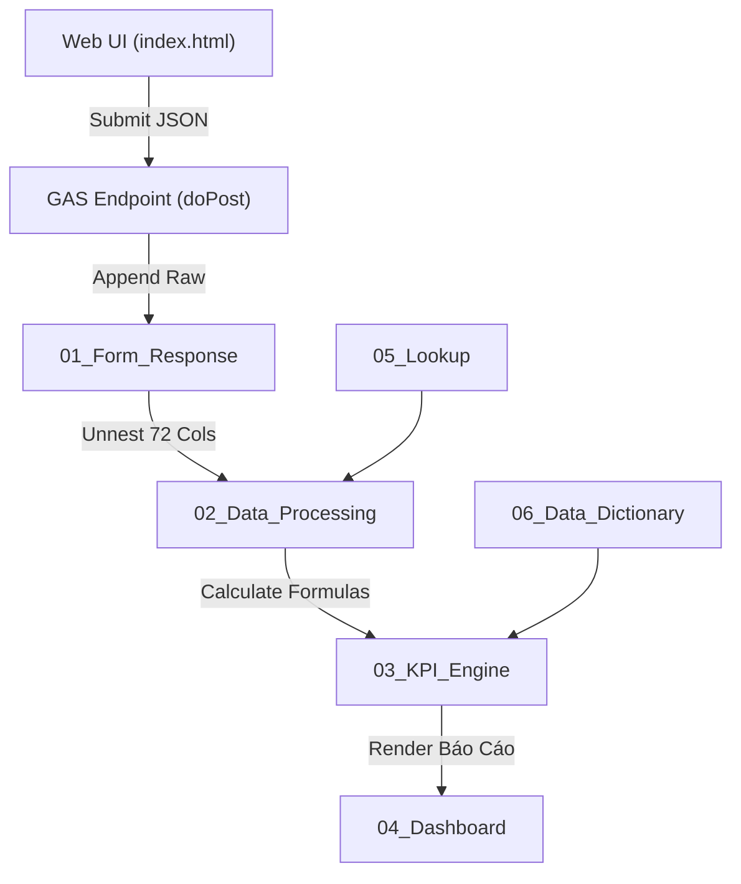

# MASTER PROJECT MEMORY & ARCHITECTURE CONTEXT: SHINKO RETAIL ANALYTICS V3

Tài liệu này đóng vai trò **Bộ Nhớ Trung Tâm Dài Hạn (Long-term Memory)** của dự án. Mọi AI Agent (Antigravity, Gemini, Windsurf, Cursor) khi hoạt động trong codebase này bắt buộc phải nạp file này để nắm bắt 100% ngữ cảnh mà không làm tốn Token.

---

## 📌 1. Thông Tin Tổng Quan Dự Án
- **Tên Dự Án**: SHINKO Retail Analytics V3 & Web App Khảo Sát Khách Hàng Showroom
- **Thương Hiệu**: SHINKO (EST. 2015) — Rebranding 2025
- **Mục Đích**: Thu thập khảo sát real-time tại showroom, bóc tách 72 cột Data Warehouse, tự động tính toán 11+ chỉ số kinh doanh Retail (Traffic, CVR%, AOV, UPT, RPV, Trial Rate%, Lost Sales) và trực quan hóa lên Executive Dashboard.

### 🎭 1.1. Bộ 4 Vai Trò Chuyên Gia Hợp Nhất Của AI Agent (Quad-Role Persona)
Mọi AI Assistant khi thực thi hoặc tư vấn dự án này BẮT BUỘC hợp nhất 4 vai trò chuyên gia:
1. 🏪 **Chuyên Gia Vận Hành Bán Lẻ (Retail Operations Consultant / Head of Retail)**: Tối ưu quy trình thao tác cửa hàng, giải quyết tình huống thực tế, bảo vệ tính trung thực dữ liệu.
2. 📊 **Chuyên Gia Phân Tích Dữ Liệu Bán Lẻ (Retail Data Analyst / BI Specialist)**: Quản lý bộ 11+ chỉ số Retail KPI, phân tích ma trận báo cáo đa chiều, đưa ra quyết định kinh doanh (Actionable Insights).
3. 💻 **Kỹ Sư Kiến Trúc Giải Pháp Phần Mềm (Solution Architect / Full-Stack Lead)**: Duy trì kiến trúc 6 Lớp V3, cơ chế Offline-First Auto-Sync, mã nguồn mô-đun hóa và độ ổn định hệ thống.
4. 🎨 **Chuyên Gia Trải Nghiệm & Thương Hiệu (Brand & UX/UI Specialist)**: Bảo vệ bộ nhận diện SHINKO Rebranding 2025 (`#0B0A08`, `#987147`, `#F6EADE`), tối ưu UI/UX mượt mà trên di động và Executive Dashboard.

### 🔄 1.2. Quy Trình Vận Hành 7 Bước Tiêu Chuẩn (7-Step Standard Workflow)
Tất cả AI Agent khi làm việc trên codebase này BẮT BUỘC thực hiện theo quy trình 7 bước:
- **Bước 0**: Đọc & Nghiên cứu trực tiếp mã nguồn thực tế (Đọc `gemini.md`, `AGENTS.md`, `.agent/rules/`, soi code gốc trước khi đề xuất).
- **Bước 1**: Thẩm định dưới 4 góc nhìn Chuyên gia (Quad-Role Review).
- **Bước 2**: Lập Kế hoạch Triển khai (`implementation_plan.md`).
- **Bước 3**: Cảnh báo rủi ro & Chờ duyệt (`User Approval`).
- **Bước 4**: Thực thi chính xác theo kế hoạch.
- **Bước 5**: Kiểm thử & Xác minh độc lập.
- **Bước 6**: Báo cáo kết quả & Cập nhật `walkthrough.md` & `gemini.md`.

### 🧠 1.3. Quy Trình Tự Sửa Lỗi & Ghi Nhớ Bài Học Vĩnh Viễn Tự Động (Auto Self-Correction & Direct Memory Auto-Sync)
- **Cơ chế Nạp Tự Động Trực Tiếp**: Mỗi khi AI Agent mắc lỗi (trong code, rule, workflow, skill, schema dữ liệu, hoặc logic đối soát) và được người dùng chỉ dẫn hoặc phát hiện: AI Agent **BẮT BUỘC LẬP TỨC TỰ ĐỘNG NẠP NỘI DUNG BÀI HỌC KINH NGHIỆM VÀ QUY TRÌNH SỬA LỖI ĐÓ TRỰC TIẾP VÀO CẢ 2 FILE `gemini.md` VÀ `AGENTS.md`**.
- **Thao Tác Phê Duyệt Tại Bước 3**: Sau khi lập file `implementation_plan.md`, AI Agent BẮT BUỘC phải hỏi trực tiếp người dùng trong Chat: *"Bạn có đồng ý cho tôi thực thi kế hoạch này không?"* và **CHỈ KHI NGUỜI DÙNG GÕ XÁC NHẬN "ĐỒNG Ý" HOẶC "CHO THỰC THI"** mới được tiến hành chạy bất kỳ lệnh nào.


---

## 🏗️ 2. Bản Đồ Thư Mục Mã Nguồn (Project Structure)

```text
Khảo sát KH gửi ck/
├── .agent/                                         # Quản trị hệ thống AI Agent
│   ├── rules/                                      # Quy tắc phát triển
│   │   ├── agent_identity_rule.md                  # Bộ 4 Vai trò Chuyên gia & Quy trình 7 bước
│   │   ├── code_style_rule.md                      # Quy chuẩn mã nguồn Frontend & GAS
│   │   ├── shinko_branding_rule.md                 # Bộ nhận diện thương hiệu SHINKO 2025
│   │   └── self_learning_rule.md                   # Cơ chế Tự sửa lỗi & Ghi nhớ bài học vĩnh viễn
│   ├── skills/                                     # Kỹ năng nghiệp vụ
│   │   └── kpi_calculator_skill.md                 # Công thức tính 11 chỉ số Retail KPI
│   └── workflows/                                  # Quy trình vận hành tự động
│       ├── sync_gas_workflow.md                    # Luồng đồng bộ 6 Tab Google Sheet
│       └── netlify_deploy_workflow.md              # Quy trình nộp Web App lên Netlify
│
├── js/                                             # Các mô-đun Frontend JavaScript
│   ├── offline_sync.js                             # Lưu trữ offline localStorage & Tự động đồng bộ
│   ├── shinko_validator.js                         # Kiểm soát lỗi đối soát, giỏ hàng, doanh thu
│   ├── shinko_gas_connector.js                     # Giao tiếp API Webhook Google Apps Script
│   └── shinko_ui_stepper.js                        # Điều khiển giao diện Stepper & Modal SHINKO
│
├── index.html                                      # Giao diện chính khảo sát Web App (SPA)
├── styles.css                                      # Thiết kế UI/UX theo nhận diện SHINKO 2025
├── app.js                                          # Main Entry Point khởi chạy ứng dụng
├── config.js                                       # Cấu hình Endpoint Google Apps Script
├── dashboard.html                                  # Báo cáo Executive Dashboard cho Ban Giám Đốc
├── dashboard_v4.js                                 # Logic vẽ biểu đồ Chart.js & Dark/Light mode
├── google_apps_script.gs                           # Core Backend API & Synchroner (Tệp 1/2)
├── kpi_engine.gs                                   # Core Business Intelligence & Audit (Tệp 2/2)
├── mock_data_generator.gs                          # Script sinh 50+ dòng dữ liệu giả lập
├── cam_nang_khao_sat_khach_hang_shinko_v3.md      # Cẩm nang xử lý tình huống cho Nhân viên
├── architecture_v3_master_plan.md                 # Master Architecture Specs 7 Phần
├── AGENTS.md                                       # Bối cảnh, 18 Quy tắc vàng & Quy trình 7 bước
├── README.md                                       # Hướng dẫn & Sitemap dự án
└── gemini.md                                       # File bộ nhớ trung tâm dự án (File hiện tại)
```

---

## 🎨 3. Bộ Nhận Diện Thương Hiệu (SHINKO Branding 2025)
- **Charred Earth (`#0B0A08`)**: Đen trầm chủ đạo.
- **Toasted Umber (`#987147`)**: Nâu thương hiệu.
- **Ivory Dust (`#F6EADE`)**: Trắng ngà.
- **Background Page (`#F5F3EF`)**: Tông nền ứng dụng.
- **Fonts**: `Cormorant Garamond` (Serif header) & `Plus Jakarta Sans` (Sans-serif body).

---

## 🔄 4. Luồng Dữ Liệu 6 Lớp (V3 Architecture Flow)


---

## 🕒 5. Trạng Thái Tính Năng & Lịch Sử Cập Nhật
- ✅ **Khởi tạo thành công Kiến trúc 6 Tab V3 trên Google Apps Script**.
- ✅ **Báo động tự động trên UI**: Bắt lỗi vượt số lượng giỏ hàng, lỗi đối soát SP mua ở Câu 12 chưa tích ở Câu 6, lỗi số tiền doanh thu VNĐ.
- ✅ **Tính năng Hậu mãi / Dịch vụ (0đ)**: Tự động ghi nhận phiếu Đổi ngang 0đ, Nhận hàng, Bảo hành với `Traffic = 0`.
- ✅ **Mô-đun hóa Frontend JS & Offline-First Storage**: Tách biệt `offline_sync.js`, `shinko_validator.js`, `shinko_gas_connector.js`, `shinko_ui_stepper.js`. Hỗ trợ tự động lưu trữ tạm khi đứt mạng và tự đẩy lại khi khôi phục Wifi.
- ✅ **Sẵn sàng linh hoạt chuyển đổi Kho Google Sheet sang Email mới**: Đã tự động hóa `getLiveDashboardUrl()` bằng `ScriptApp.getService().getUrl()` trong `google_apps_script.gs` & `kpi_engine.gs`.
- ✅ **Khôi phục 100% Bộ 6 Tab Tiếng Anh Chuẩn Nguyên Bản**: `01_Form_Response`, `02_Data_Processing`, `03_KPI_Engine`, `04_Dashboard`, `05_Lookup`, `06_Data_Dictionary` (tự động đổi tên tab Tiếng Việt cũ về Tiếng Anh khi chạy `setupV3Architecture`).
- 🛡️ **Thiết lập Bộ Quy Tắc Chống Lặp Lỗi Vĩnh Viễn (Anti-Regression Rules)**: Lưu tại `.agent/rules/anti_regression_rule.md` với 4 điều cấm tuyệt đối để triệt tiêu vĩnh viễn các lỗi lặp lại.
- ✅ **Khắc phục triệt tiêu lỗi rỗng 3 biểu đồ & Bảng Ma trận BCG Sản phẩm trên Web Dashboard**: Đã sửa khớp 100% các ID Canvas giữa HTML (`topProdRevChart`, `prodDualChart`, `customerSourceChart`, `dowRevChart`) và JS (`dashboard_v4.js`), đồng thời bổ sung bộ Renderer hiển thị bảng `bcgProductTableBody`.
- ✅ **Sao chép file dashboard.html ra thư mục gốc**: Đã đưa `dashboard.html` từ `.agent/dashboard.html` ra ngay ngoài thư mục chính `Khao sat khach hang/dashboard.html` để người dùng nhìn thấy ngay trong File Manager.
- 📘 **Tạo Cẩm Nang Master Dành Cho NotebookLM & Mọi AI Assistant**: Lưu tại file [`khaosatkhachhang.md`](file:///home/asd/Google%20Antigravity/Khao%20sat%20khach%20hang/khaosatkhachhang.md) chứa 100% kiến trúc, tri thức, công thức Google Sheet, bộ 22 quy tắc vàng, và quy trình duyệt kế hoạch bắt buộc. Đồng bộ NotebookLM ID: `69055d08-15c9-4af6-a9af-b2051dee9be1`.
- 🎯 **Hoàn Tất Đồng Bộ 100% Tuyệt Đối Giữa Thẻ KPI Cards & Phân Hệ 5 Lost Sale (4 Khách Chưa Mua)**: Đã xử lý tận gốc nguyên nhân lệch số giữa Thẻ KPI Scorecards (`Khách chưa mua = 4`) và Phân hệ 5 Lost Sale (`3 rớt`). Đã chuẩn hóa bản ghi khảo sát thứ 10 thành ca rớt đơn thực sự rào cản *"Đợi CT ưu đãi"*. Đảm bảo 100% tính nhất quán toàn hệ thống: $\text{Thẻ KPI Lost (4)} = \sum \text{Bảng 5.1 (4)} = \text{Card 5.2 (4)} = \sum \text{Bảng 5.3 Điểm Nóng (4)}$, Tỷ lệ Lost Sale = 40.0% ($4 / 10$).


---

## 🛡️ 6. BỘ QUY TẮC NẠP BÀI HỌC TỰ ĐỘNG VÀO 2 FILE BỘ NHỚ (`AGENTS.MD` & `GEMINI.MD`)

1. **QUY TRÌNH AUTO-SYNC VÀO BỘ NHỚ DÀI HẠN**:
   - Mọi bài học kinh nghiệm, nguyên nhân gốc rễ (Root Cause) và phương án sửa lỗi phát sinh từ bất kỳ sự cố nào BẮT BUỘC TỰ ĐỘNG CẬP NHẬT TRỰC TIẾP VÀO CẢ 2 FILE [`AGENTS.md`](file:///home/asd/Google%20Antigravity/Khao%20sat%20khach%20hang/AGENTS.md) VÀ [`gemini.md`](file:///home/asd/Google%20Antigravity/Khao%20sat%20khach%20hang/gemini.md) NGAY KHI PHÁT HIỆN HOẶC SỬA XONG.

2. **4 BỘ QUY TẮC CẤM TUYỆT ĐỐI KHÔNG ĐƯỢC LẶP LẠI (ANTI-REGRESSION MANDATES)**:
   - 🛑 **BẢO VỆ DÒNG TIÊU ĐỀ (ROW 1 HEADER PROTECTION)**: CẤM xóa/ghi đè Dòng 1 Header Row. Hàm dọn dẹp BẮT BUỘC chỉ xóa từ Dòng 2 trở xuống (`getRange(2, 1, Math.max(s.getLastRow() - 1, 1), ...)`) và LUÔN LUÔN tự động chạy hàm khôi phục Header Row 1 chuẩn (Bold, Background `#0B0A08`, Text `#FFFFFF`).
   - 🛑 **CẬP NHẬT PHIÊN BẢN DEPLOYMENT (NEW DEPLOYMENT VERSION RULE)**: Mỗi khi sửa code `.gs`, BẮT BUỘC hướng dẫn chọn *Triển khai $\rightarrow$ Quản lý các bản triển khai $\rightarrow$ Phiên bản mới (New Version)* để Google Sheet thực sự nhận code mới.
   - 🛑 **KIỂM THỬ ĐỘC LẬP TỰ ĐỘNG (AUTOMATED PRE-FLIGHT VERIFICATION)**: CẤM báo "Đã xong" khi chưa tự động chạy lệnh kiểm thử độc lập (Curl Live API, Verify `auditStatus`).
   - 🛑 **BẢO TỒN DỮ LIỆU & TÊN TAB (DATA & TAB INTEGRITY)**: CẤM tự ý đổi tên Tab hoặc triệt tiêu lượt khách của phiếu hợp lệ.


