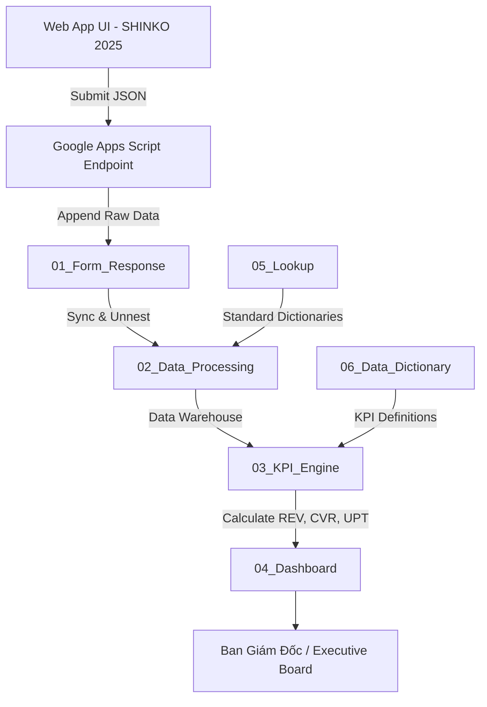

# SHINKO SHOWROOM SURVEY WORKFLOW SKILL (ARCHITECTURE V3)

Skill này cung cấp quy trình chuẩn hóa dành cho AI Agent để quản lý, chỉnh sửa, nâng cấp và triển khai hệ thống Web App Khảo Sát Khách Hàng thương hiệu **SHINKO (EST. 2015)** kết nối Google Sheets theo **Kiến trúc 6 Lớp (SHINKO Retail Analytics V3)**.

## 1. Kiến Trúc 6 Lớp (V3 Architecture Flowchart)

## 2. Quy Tắc Các Module

- **`01_Form_Response`**: Không sửa dữ liệu gốc.
- **`02_Data_Processing`**: Phân rã ngày/giờ/thứ, tách sản phẩm, tạo các cột cờ trợ lý.
- **`03_KPI_Engine`**: Nơi duy nhất tính toán công thức KPI (TRAFFIC, CVR, UPT...).
- **`04_Dashboard`**: Chỉ hiển thị báo cáo.

## 3. Tiêu Chuẩn Thiết Kế SHINKO 2025

- **Primary**: `#987147` (Toasted Umber)
- **Dark Accent**: `#0B0A08` (Charred Earth)
- **Light Accent**: `#F6EADE` (Ivory Dust)
- **Background**: `#F5F3EF`
- **Fonts**: `Cormorant Garamond` & `Plus Jakarta Sans`

## 4. Checklist Triển Khai (Deployment Checklist)

- [ ] Mở Google Apps Script trong Google Sheet.
- [ ] Dán mã nguồn từ `google_apps_script.gs`.
- [ ] Bấm nút ▶️ **Chạy (Run)** hàm `setupV3Architecture` để tự động tạo 6 Module V3.
- [ ] Triển khai Web App (`Execute as: Me`, `Access: Anyone`).
- [ ] Copy URL Web App và dán vào `app.js`.
- [ ] Kéo thả file `KhaoSatKhachHang.zip` lên Netlify Drop.
